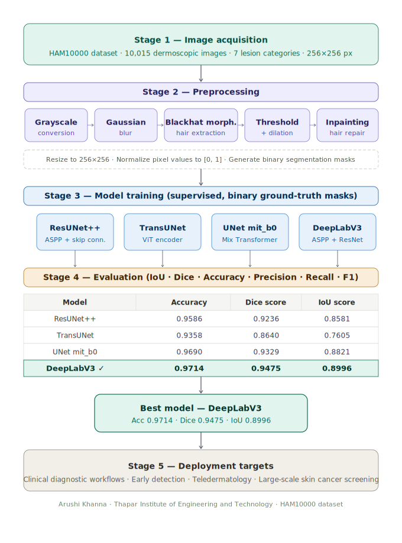

# Automated Skin Lesion Segmentation Using Deep Learning

Research project comparing four deep learning architectures for dermoscopic skin lesion segmentation on the HAM10000 dataset.

> **Note:** This repository contains the notebooks I personally implemented — **ResUNet++** and **TransUNet**. The DeepLabV3 and UNet mit_b0 experiments were conducted by co-authors and are not included here.

---

## Overview

Skin cancer, particularly melanoma, demands early and accurate diagnosis. Manual dermoscopic interpretation is subjective and inconsistent. This project builds an automated pipeline — preprocessing → segmentation → evaluation — using state-of-the-art deep learning models.

**Key contribution:** A morphology-based Blackhat hair removal pipeline is applied before segmentation, significantly improving lesion boundary clarity across all models.

---
## Pipeline



---

## Repository Structure

```
├── skin-lesion-segmentation-using-resunet.ipynb    # ResUNet++ implementation
├── skin-lesion-segmentation-using-transunet.ipynb  # TransUNet implementation
└── README.md
```

---

## Dataset

**HAM10000** (Human Against Machine with 10,000 training images) — a large publicly available dermoscopic image dataset containing 10,015 images across 7 lesion categories:

| Label | Class |
|-------|-------|
| nv | Melanocytic nevi (benign) |
| mel | Melanoma |
| bkl | Benign keratosis-like lesions |
| bcc | Basal cell carcinoma |
| akiec | Actinic keratoses / Bowen's disease |
| vasc | Vascular lesions |
| df | Dermatofibroma |

Source: [Kaggle — HAM10000 Segmentation and Classification](https://www.kaggle.com/datasets/surajghuwalewala/ham1000-segmentation-and-classification)

Binary segmentation masks (lesion as foreground, skin as background) are used for supervised training.

---

## Preprocessing Pipeline

Both notebooks share the same preprocessing pipeline:

**1. Hair Removal (Blackhat Morphology)**

Hair artifacts in dermoscopic images corrupt boundary detection. The pipeline:
- Convert to grayscale
- Apply Gaussian blur
- Perform Blackhat morphological operation (rectangular structuring element)
- Binary threshold + dilation to isolate hair regions
- Inpaint detected regions using surrounding context

**2. Resize & Normalize**
- All images and masks resized to **256×256 pixels**
- Pixel values normalized to **[0, 1]**

---

## Models

### ResUNet++ *(this repo)*
Extends U-Net with residual connections, ASPP for multi-scale feature extraction, and Squeeze-and-Excitation blocks for channel-wise attention. Trained for 5 epochs.

### TransUNet *(this repo)*
Hybrid CNN-Transformer architecture. Uses a CNN backbone for low-level feature extraction followed by a Transformer encoder for global context modeling. Trained for 5 epochs.

### DeepLabV3 *(co-author, not in this repo)*
Uses atrous (dilated) convolutions and ASPP with a pretrained ResNet backbone. Best overall performer in the paper.

### UNet mit_b0 *(co-author, not in this repo)*
U-Net variant with a Mix Transformer (MiT-B0) encoder from SegFormer. Highest Dice score among all models.

---

## Results

### Notebook Results (my runs, 5 epochs on subset)

| Model | Accuracy | Precision | Recall | Dice | IoU |
|-------|----------|-----------|--------|------|-----|
| ResUNet++ | 0.9387 | 0.8778 | 0.8619 | 0.8698 | 0.7696 |
| TransUNet | 0.8940 | 0.8823 | 0.6392 | 0.7414 | 0.5890 |

### Full Paper Results (all 4 models, complete training)

| Model | Accuracy | Dice Score | IoU |
|-------|----------|------------|-----|
| ResUNet++ | 0.9586 | 0.9236 | 0.8581 |
| TransUNet | 0.9358 | 0.8640 | 0.7605 |
| UNet mit_b0 | 0.9690 | 0.9329 | 0.8821 |
| **DeepLabV3** | **0.9714** | **0.9475** | **0.8996** |

DeepLabV3 achieved the best overall balance of accuracy, recall, and boundary precision, making it the recommended model for clinical deployment.

---

## Setup

```bash
pip install torch torchvision opencv-python scikit-learn tqdm matplotlib seaborn
```

Both notebooks are designed to run on **Kaggle** (GPU T4 x2). The dataset path is `/kaggle/input/ham1000-segmentation-and-classification/`.

To run locally, update the dataset path at the top of each notebook and ensure a CUDA-capable GPU is available.

---

## Acknowledgements

- HAM10000 dataset: Tschandl et al., *Scientific Data*, 2018
- ResUNet++: Jha et al., IEEE ISM 2019
- U-Net: Ronneberger et al., MICCAI 2015
